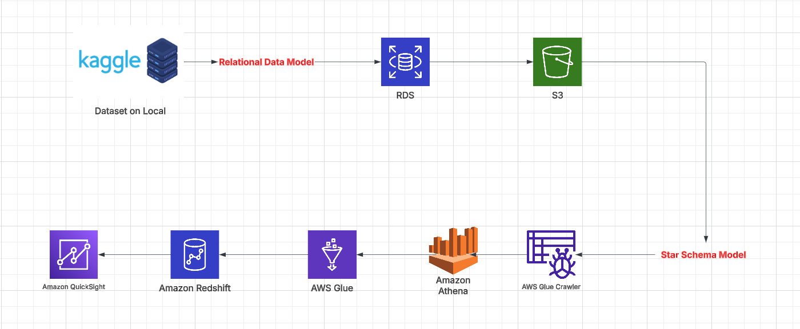
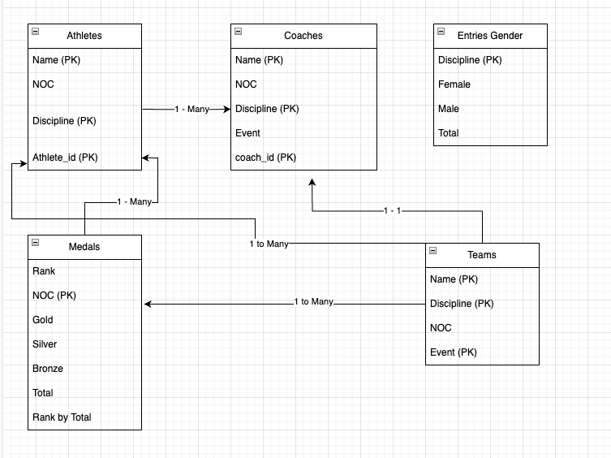
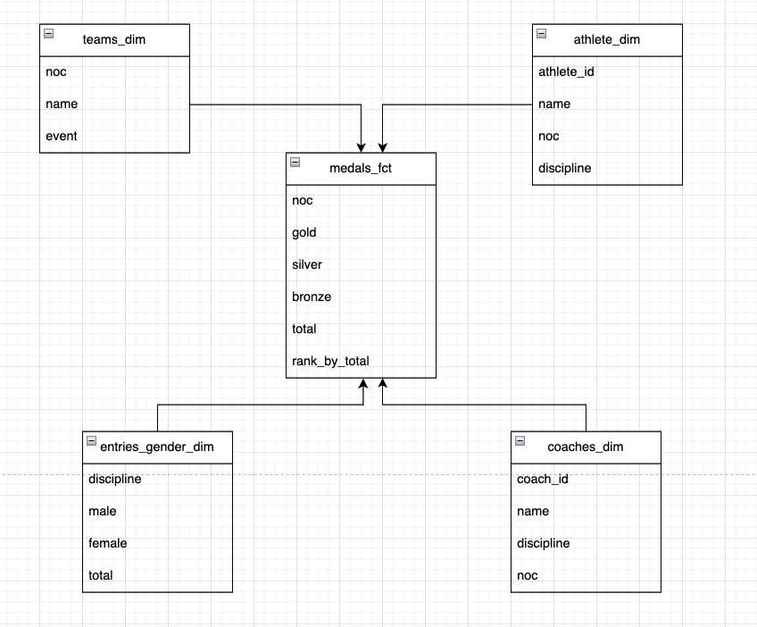
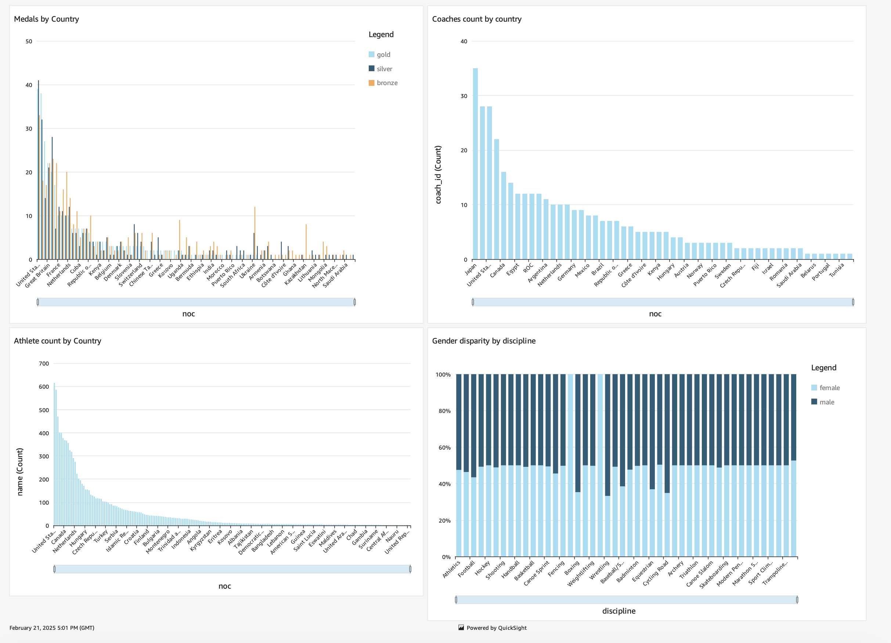

# Tokyo Olympics End to End ETL

## Overview
In this project, I created an end-to-end ETL pipeline to analyze the 2021 Tokyo Olympics data and derive key insights. My motivation was to broaden my understanding of AWS Cloud Services and dive deeper into data warehousing and ETL concepts.

## Tech Stack
- **Cloud**: AWS
- **Relational Database**: Amazon RDS for PostgreSQL
- **Object Storage**: Amazon S3
- **Data Cataloging and ETL**: AWS Glue
- **Querying and Analysis**: Amazon Athena
- **Data Warehouse**: Amazon Redshift
- **Visualization**: Amazon QuickSight

## Project Workflow

## Data Source
The Dataset was derived from Kaggle. The dataset contains details of over 11,000 athletes across 47 disciplines, representing 743 teams in the Tokyo Olympics. It includes information on athletes, coaches, teams, and gender participation. I stored the data locally on my computer.
Link : https://www.kaggle.com/datasets/arjunprasadsarkhel/2021-olympics-in-tokyo

## Key Steps

## 1. Data Modeling

The first step was to build an understanding of the data we were dealing with. This meant knowing the data types of the columns and whether the data was ordinal or categorical. That analysis was essential and informed the different dimension and facts tables that we model in Step 5.

We also identified entities and their relationships. This meant coming up with primary and foreign keys and making sure we follow integrity constraints. We tried to make sure that the data was normalized and that each table's information is not duplicated in other tables.

All our findings were highlighted in the Relational Model diagram below

## 2. Data Loading

Once we had procured the data on our local computer and created a model of our relational system, it was time to load the data into a relational database.

### Choice of Database

We chose AWS RDS for PostgreSQL as our relational database. Amazon RDS (Relational Database Service) is a managed cloud database service that handles tasks like database setup, patching, backups, and scaling, allowing us to focus on database management and query execution.

### Data Loading Process

To load the data, we wrote a Python script that used the following technologies:
- Pandas: First, we read the CSV files using pandas.read_csv(), which allowed easy manipulation and inspection of the data.
- SQLAlchemy: We used SQLAlchemy, a powerful SQL toolkit and Object-Relational Mapping (ORM) library, to interact with the PostgreSQL database. It allowed us to create database connections, perform queries, and execute transactions.
- Column Mapping: Based on our relational model, we defined column mappings to ensure the data was correctly aligned with the database schema.
- Bulk Data Loading: We used to_sql() from SQLAlchemy to efficiently load our dataset into the RDS instance.

### Verification

Once the data was loaded, we needed to verify that the data transfer was successful. For this, we used SQLectron, a lightweight SQL client with an intuitive interface that supports secure connections to cloud databases.
- Connecting to AWS RDS: Using SQLectron, we connected to our RDS instance by providing our AWS credentials and database endpoint.
- SQL Queries: We ran SQL queries to check table contents, validate row counts, and ensure data consistency.
- Data Validation: Compared the loaded data with the original CSV files to confirm accuracy.

## 3. Storage Optimization

Initially, my thought was to perform the ETL process directly from the AWS RDS database. However, upon further investigation, we learned that relational databases like RDS are primarily designed for Online Transaction Processing (OLTP), which involves real-time insertions, deletions, and updates. Using RDS for an ETL process, especially if it runs daily with batch data, could place a heavy load on the database. This could lead to issues like table lockouts or performance degradation, which would impact real-time OLTP operations. Therefore, we decided to move our data to a more scalable solution, S3, which offered several advantages.

### Why S3?

1. **Decoupled Storage and Compute**: One of the main benefits of using S3 over RDS is the decoupling of storage and compute. In an RDS setup, both the storage and compute are tightly coupled, meaning you'd be paying for both storage and compute even when only performing ETL tasks. This is inefficient because during ETL processing, the database is used for both storing data and performing computations (processing queries), which can drain resources like CPU and memory. This could slow down the entire system, especially in a production environment where RDS handles OLTP tasks. On the other hand, S3 separates storage from compute, allowing for independent scaling. With S3, we can scale up compute resources—such as adding more Spark nodes on AWS EMR or Glue—without impacting the live database. This flexibility ensures that the ETL process runs smoothly without slowing down OLTP operations.

2. **Cost-Effective and Scalable Storage**: S3 also provided a more cost-effective solution for data storage compared to RDS. S3 allows for virtually unlimited storage, and its pricing model is more affordable for large datasets. The flexibility of scaling storage without worrying about the underlying infrastructure makes S3 an ideal choice for handling the growing volume of data.

3. Columnar Storage with Parquet S3 supported columnar storage, which we took full advantage of by using the Parquet format. Parquet is a columnar storage format that is highly optimized for both data storage and querying. It uses compression algorithms to store data more efficiently, leading to reduced space requirements. For example, by using techniques like Run-Length Encoding (RLE) and other compression methods, Parquet can significantly reduce the size of the data compared to row-based formats like CSV.

For analytical workloads, columnar formats like Parquet are ideal because queries can scan only the relevant columns instead of the entire dataset. This reduces the amount of data read, speeding up query times and optimizing resource usage. Additionally, Parquet has great compatibility with processing frameworks like Apache Spark, which we used in our ETL pipeline. This made Parquet a perfect choice for our needs.

### Data Migration from RDS to S3

To move data from RDS to S3, we wrote a custom script using the psycopg2 library to connect to our RDS cluster. The script fetched data from PostgreSQL, converted it into Parquet format using the to_parquet method and the fastparquet engine, and then loaded the data into an in-memory buffer (BytesIO). By processing the data in memory rather than writing it to disk, we minimized disk I/O operations, which helped reduce latency.

The in-memory processing also provided several advantages:
- Faster Processing: Since the data never touched the disk, memory access was much faster, reducing the time required to process and transfer the data.
- Reduced Latency: The avoidance of disk I/O operations helped minimize latency during data transfer.
- Data Security: By processing data in memory, we also reduced concerns about file persistence or data exposure that could occur if the data were written to disk.

After the data was converted into Parquet format and loaded into memory, it was then pushed directly into the S3 bucket, completing the migration process.

## 4. Data Catloging and Verification
After the data was successfully loaded into Amazon S3, the next step was to enable an automated mechanism to understand the structure and schema of the data. For this, we used AWS Glue Crawler, a tool designed to automatically discover the metadata of data stored in S3 and populate the AWS Glue Data Catalog with relevant information.

### Behind the Scenes: Glue Crawler
The Glue Crawler is essentially a metadata discovery tool that scans data stored in S3 and catalogs it into a structured format within the AWS Glue Data Catalog. It performs a few key tasks:

- Scanning Data: The Glue Crawler automatically scans files in the S3 bucket, reading the data stored in formats like Parquet, CSV, JSON, or others. In our case, it focused on Parquet files.

- Schema Inference: As it scans the files, the Crawler infers the schema of the data (the column names, data types, and relationships between columns). For instance, it will determine if a column is an integer, string, date, or timestamp, based on the data in the file.

- Partition Identification: The Crawler also identifies any partitioning structure present in the data, like dates or geographical regions. Partitions help organize the data for efficient querying, especially in large datasets. For example, if our data is partitioned by date (e.g., “year=2025/month=01/day=01”), the Glue Crawler would register this partitioning in the catalog.

- Table Definition: After inferring the schema and partitions, the Crawler creates the table definition in the Glue Data Catalog. This table definition includes the name of the table, the schema (column names and data types), the partitioning information, and other relevant metadata like the data format (Parquet).

### Verifying Data with Athena
Once the data metadata was recorded in the Glue Data Catalog, we turned to Amazon Athena to verify the data and confirm that it was consistent with the original data in RDS and that the schema matched.

## 5. Dimensional Modelling
Now that our data was properly stored and ready for consumption, it was time to think of how we would be using this data - What kind of Analytical queries would the data be used for, what kind of joins would be needed and how would a data or business analyst use the data. This informed how we created a Star Schema model and designed our facts and dim tables. 

We created the following Model

## 6. ETL process
After successfully loading the data into Amazon S3 and defining our dimensional model, the next crucial step was to implement the ETL (Extract, Transform, Load) process to move the data from its raw format into a usable state in the data warehouse. This involved creating and running ETL jobs using AWS Glue Notebooks, which provided a convenient and scalable environment for managing our data workflows.

### Overview of the ETL Process
The primary purpose of the ETL process in this step was straightforward: we needed to:
- Extract data from S3, leveraging the AWS Glue Data Catalog as a bridge for metadata management and schema inference.
- Transform the data to align with the dimensional model we had designed.
- Load the transformed data into Serverless Redshift, Amazon’s managed data warehouse service, which allows us to scale our data storage and analytics needs without worrying about infrastructure management.

While the main ETL process was relatively straightforward, several prerequisites had to be addressed to ensure the process could run smoothly. These prerequisites were critical for ensuring data consistency, accuracy, and performance throughout the pipeline. In the next section, which focuses on the Data Warehouse, I will detail these prerequisites.

## 7. Data Warehousing
The final step of the ETL process was to load the transformed data into Serverless Redshift, which is a scalable and cost-efficient cloud data warehouse solution provided by Amazon Web Services (AWS). To ensure that the loading process was smooth, we followed several critical steps to prepare the Redshift environment, configure the necessary services, and then validate that the data was correctly loaded. These preparatory tasks were essential for the success of the ETL pipeline.

### Key Steps in the Redshift Data Loading Process
1. Creating a Namespace: Defines the Storage part solution like DBs, tables, encryptions etc.
2. Creating a Workgroup: A workgroup in Redshift defines the compute resources that are associated with a particular namespace. Workgroups help manage the computational load that is required to perform queries and data processing tasks. Since we used the Serverless Redshift free trial, I opted for the smallest workgroup size available, X-Small, which is sufficient for small-scale data operations.
3. Attaching an IAM Role: In Redshift, IAM (Identity and Access Management) roles are used to define the permissions that a specific service, such as Redshift, has to interact with other AWS services like S3.
4. Configuring Network Settings: AWS provides virtual private cloud (VPC) configurations that help isolate and secure the infrastructure. To ensure that the AWS Glue and Redshift services could communicate securely, I had to configure the network settings properly:
    -  Both Glue and Redshift services had to be located within the same VPC.
    -  I had to ensure that the security groups associated with both services allowed traffic between them. Security groups act as a virtual firewall, and by adjusting the rules, I allowed Redshift to securely interact with the Glue service, where data transformation was happening, and vice versa.
5. Schema Creation in Redshift: Before we could load data into Redshift, we needed to define the schema of our tables.The Redshift schema needs to be carefully designed to match the dimensional model we had previously created.

Once all these prerequisite configurations were completed, we were ready to run the ETL pipeline to load the data into Serverless Redshift.

### Verifying the Data Load
After the ETL process was completed and the data was loaded into the Redshift cluster, it was time to verify that the data had landed correctly and was available for analysis. For this, I used the Redshift Query Editor, a tool provided by AWS to run SQL queries directly against the data stored in Redshift.

Out of curiosity, I took a deeper dive into some of the features of Amazon Redshift that I found particularly interesting. Below are a few of the key features:

1.  **Massively Parallel Processing** (MPP) - Amazon Redshift uses MPP architecture to enable efficient query execution across distributed nodes in a cluster. In an MPP system, the workload is divided across multiple nodes, allowing for parallel processing and significantly improving performance.

    In Redshift's MPP setup:  
    - There is a leader node and multiple compute nodes.  
    - The leader node is responsible for managing query execution, dividing the work into smaller tasks, coordinating between the compute nodes, and then aggregating the results before sending them back to the client.  
    - The compute nodes store portions of the data, execute computations locally, and send the results back to the leader node for aggregation.
    This architecture enables parallel processing, where each compute node works independently, allowing the system to process large datasets efficiently. It's somewhat similar to Apache Spark, but focused on SQL-based       
    analytical queries. The ability to distribute the processing load across nodes makes query execution faster, even for complex operations on large datasets.

2. **Customizable Data Distribution and Sorting** - Redshift allows you to customize how your data is distributed and sorted across nodes, which can greatly optimize performance, especially for frequently run queries. When defining your DDL (Data Definition Language) statements, you can specify how the data should be distributed and sorted across the compute nodes using different distribution styles (key, even, or all).By customizing the distribution, you can optimize queries that are run regularly. For example, let’s say you have a dashboard service that queries a Redshift database daily. One of the queries might involve grouping employees by department and performing calculations on the group. If Redshift stores data for the same department on the same compute node, that query will run significantly faster because the relevant data is localized on the same node, minimizing the need to move data between nodes (shuffling). This ensures more efficient query processing and faster performance for the end-user.
  
## 8. Data Analysis
At this point we completed our ETL process succesfully and wanted to show how that data in the data warehouse could be leveraged. So we decided to use AWS QuickSight to analyse the data. We used Redshift as our source and also made sure these services were in the same VPC, so they could communicate with each other. 

For our analysis, we created a dashboard which comprised of multiple line charts answering questions like 'How does participation look like by country' or 'what was the distribution of medals by country'. We learned that we could also embed this dashboard in something like a webpage which users could refresh and use on a daily basis. 

By working with AWS QuickSight I also learned that it uses a capability called SPICE (Super-Fast Parallel in-memory Calculation Engine). Its main objective is to improve the speed of data analysis by caching the data from redshift. This is especially useful when the data is static or when we are dealing with very slowly changing dimension tables. In my case, it was a single time data load into redshift and so I could leverage SPICE to make my dashboard queries faster. Ive learned that we can also use both SPICE and live query together - We can use SPICE for static or slowly changing dimensional tables and use the live query for tables that change daily. 

This marked the end of my project

## Summary
Overall this was a very fun project!. If I were to go back and redo this project these are the things I would pay more attention to: 
- Managing costs and how that would change with larger datasets (Learn more about Cost Estimator) - Used the free tier and had to delete the resources after the completion of the project.
- Think more about the dimensional and relational models and how they can be denormalized/normalized better respectively to improve the performance of queries.

